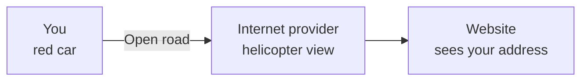
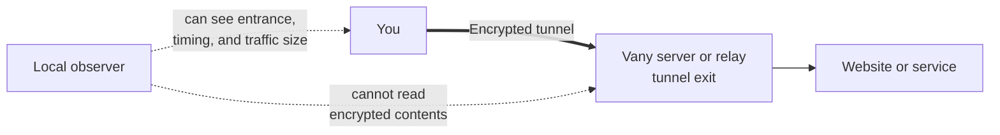
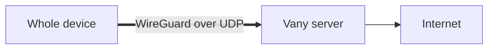
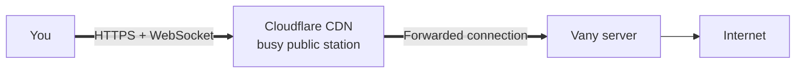
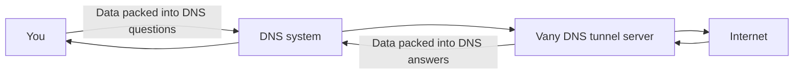
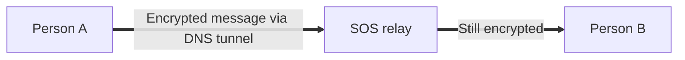
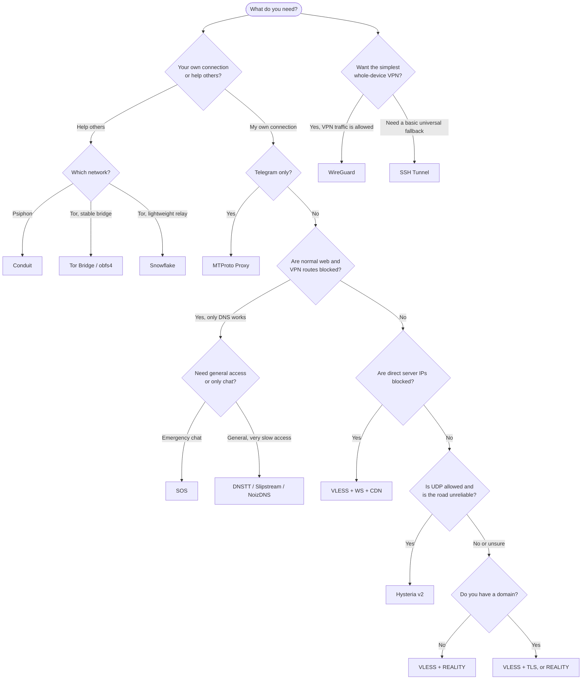

# Draft: General Concepts — The Getaway Car, the Tunnel, and the Paint Shop

> **Review status:** This is the proposed Markdown for a future documentation page. It is not yet linked from the public docs.
>
> **Audience:** People who want to choose a Vany protocol without first learning networking terminology.

## The story in one minute

Imagine you are driving a bright red car. A helicopter can see where you start, follow the road, and see where you finish.

Going through a tunnel helps: while you are inside, the helicopter cannot see what you do. That is what **encryption** does—it hides the contents of your journey.

But encryption alone is not the whole escape plan. If the helicopter watches a red car enter a private tunnel and the same red car leave the only exit, it can still make a good guess about where you went. It may even block the tunnel entrance.

So a stronger plan can add several tricks:

1. Enter a tunnel so nobody outside can see what is carried in the car.
2. Exit somewhere else so websites see the tunnel's address, not your starting address.
3. Repaint the car inside so it does not look like the vehicle that entered.
4. Use a busy public exit so your car blends into ordinary traffic.
5. Keep a slow emergency route through utility passages for days when every road is closed.

Those tricks correspond to **tunneling, proxying, camouflage, relays,** and **fallback protocols**. Different Vany protocols combine them in different ways.

> [!IMPORTANT]
> No protocol makes a person magically invisible. Your internet provider or network administrator can usually see that you connected to *something*, the connection time, and roughly how much data moved. Accounts, cookies, device fingerprints, malware, and information you share can still identify you.

## First: what are we trying to hide?

Without a tunnel, the journey is direct:



With a protected route, the provider sees the tunnel entrance, while the destination usually sees the exit server:



The protection has three separate questions:

| Question | Road-story version | Networking term |
|---|---|---|
| Can an observer read what I send? | Can the helicopter see inside the car? | **Encryption** |
| Which apps take the protected route? | Does the whole convoy enter, or just one car? | **VPN vs proxy** |
| Does the route look suspicious? | Is this an obvious private tunnel or an ordinary road? | **Camouflage / obfuscation** |

## VPN and proxy: similar tunnels, different entrances

### VPN: redirect the whole convoy

A **VPN** normally gives the whole device a new route. Browsers, chat apps, updates, and other network traffic can all enter it. In the story, a roadblock diverts nearly every car from your town through one protected tunnel.

```text
Phone or laptop
  ├─ Browser ─────┐
  ├─ Messenger ───┼──> VPN tunnel ──> Vany server ──> Internet
  └─ Other apps ──┘
```

This is convenient, but the tunnel itself may have a recognizable entrance. Vany's clearest full-device VPN option is **WireGuard**.

### Proxy: give selected cars a secret route

A **proxy** is usually configured by an app, or by a proxy-capable client. Only traffic sent to that proxy uses it. In the story, selected drivers know about a hidden ramp; everyone else stays on the normal road.

```text
Browser configured for proxy ──> protected route ──> Vany server ──> Internet
Other apps                 ──> normal connection ──> Internet
```

Proxies can be easier to disguise as ordinary web traffic. VLESS, Hysteria, SSH, and MTProto options belong broadly in this family, although a client app can sometimes route most device traffic through a proxy.

> [!NOTE]
> “VPN” does not automatically mean more private, and “proxy” does not automatically mean unencrypted. The protocol, client settings, DNS behavior, and threat you face matter more than the label.

## Now improve the escape plan

### Plan A: a fast, purpose-built tunnel — WireGuard

**WireGuard** is the clean modern tunnel: fast, efficient, and able to carry the whole device. It is like a private express tunnel built specifically for your convoy.

The trade-off is that its entrance has a recognizable shape. A censor that blocks this tunnel design—or blocks UDP traffic—may stop the car before it enters.



**Choose it when:** the network allows VPNs and you want speed and simple whole-device coverage.

```bash
# Run on your own VPS; the same command installs or opens management.
curl vany.sh/wg | sudo bash
```

### Plan B: repaint the car to resemble normal web traffic — VLESS family

If obvious private tunnels are stopped, make the protected journey resemble the huge stream of ordinary HTTPS traffic.

#### VLESS + REALITY: borrow the look of a familiar car

**REALITY** makes the connection resemble a visit to a normal, well-known HTTPS website. In the story, the red car enters the paint shop and comes out looking like a common delivery vehicle that belongs on the road. You do not need to own a domain.

It still connects directly to your server, so an observer can block that server's IP address if they discover it.

```text
You == encrypted connection that resembles ordinary HTTPS ==> Vany server --> Internet
```

**Choose it when:** you want a strong general-purpose default without buying or configuring a domain.

```bash
curl vany.sh/reality | sudo bash
```

#### VLESS + TLS (V2Ray): use your own registered paint job

**VLESS + TLS**, listed as `vray`, uses a real certificate for a domain you control. The car has legitimate plates and paint rather than borrowing another site's appearance. It is conventional, widely understood HTTPS camouflage, but it needs a domain and certificate setup.

**Choose it when:** you own a domain and prefer a traditional TLS configuration.

```bash
curl vany.sh/vray | sudo bash
```

#### VLESS + WebSocket + CDN: leave through a crowded public station

**WebSocket + CDN**, listed as `ws`, first travels to Cloudflare. Cloudflare then forwards it to your server. In the story, the car enters a huge public transport terminal, changes appearance inside, and uses a private service road to reach the real exit. An outside observer sees the busy terminal rather than your server's address.



**Choose it when:** direct server IPs are blocked and you have a domain configured with Cloudflare.

```bash
curl vany.sh/ws | sudo bash
```

#### HTTP Obfuscation: put a familiar destination on the sign

**HTTP Obfuscation**, listed as `http-obfs`, disguises proxy traffic with ordinary-looking HTTP details such as a familiar host name. Think of changing the road sign and paperwork so a quick checkpoint inspection sees a common delivery route.

This is a lighter disguise than a fully protected modern TLS design. It can help against simpler filtering, but should not be treated as the strongest choice against careful inspection.

**Choose it when:** a compatible CDN/fronting setup works on the local network and stronger direct methods do not.

```bash
curl vany.sh/http-obfs | sudo bash
```

### Plan C: change the engine as well as the paint — Hysteria v2

**Hysteria v2** uses QUIC over UDP and is designed to keep moving on lossy, throttled, or unstable roads. Imagine a rally car whose suspension and engine are built for damaged roads, while its bodywork still resembles common modern traffic.

It can be very fast where UDP works. If the checkpoint closes all UDP lanes, however, this car cannot enter.

**Choose it when:** the connection is unreliable or throttled, but UDP is available.

```bash
curl vany.sh/hysteria | sudo bash
```

### Plan D: use a tunnel that almost every server already has — SSH Tunnel

An **SSH tunnel** creates a SOCKS5 proxy through the same secure access commonly used to administer servers. In the story, you use the maintenance tunnel already built into the road system.

It is familiar and easy to find on almost any VPS, but its shape is also familiar to censors. It is a practical basic option, not sophisticated camouflage.

**Choose it when:** you need a simple fallback and SSH connections are allowed.

```bash
curl vany.sh/ssh-tunnel | sudo bash
```

### Plan E: build one special lane for Telegram — MTProto

**MTProto Proxy**, listed as `mtp`, is not a road for every app. It is a protected, camouflaged lane made specifically for Telegram. Fake TLS is the paint job that helps the lane resemble ordinary HTTPS.

**Choose it when:** Telegram access is the goal and you want native Telegram proxy support.

```bash
curl vany.sh/mtp | sudo bash
```

## When roads are closed: send messages through the utility pipes

During severe filtering, web and VPN roads may be closed while DNS still works because devices need it to find internet addresses. DNS tunnels cut data into many tiny parcels and pass them through that remaining utility system.



This route is narrow and slow. Treat it as an emergency passage, not a highway for video calls or large downloads. The DNS tunnel options also compete for the same DNS port on one server, so normally only one should be installed there.

### DNSTT: the basic emergency pipe

**DNSTT** carries encrypted tunnel data inside DNS queries and answers. It is the simple utility-pipe escape route: slow, but valuable when ordinary connections fail.

```bash
curl vany.sh/dnstt | sudo bash
```

### Slipstream: a more efficient cart in the pipe

**Slipstream** enhances the DNS route with QUIC and TLS techniques. It is still constrained by the narrow pipe, but aims to move parcels more efficiently than the basic approach.

```bash
curl vany.sh/slipstream | sudo bash
```

### NoizDNS: make the parcels less uniform

**NoizDNS** is a DNSTT variant that adds noise and padding. In the story, parcels receive varied wrapping and filler so an inspector has a harder time recognizing a repeated tunnel pattern.

```bash
curl vany.sh/noizdns | sudo bash
```

## Some Vany protocols help other drivers instead

The next options are **relays**, not personal exits for the VPS owner. You donate a small station, bridge, or vehicle so people using an existing network can get through.

### Conduit: host a Psiphon transfer station

**Conduit** turns your server into a volunteer Psiphon relay. Other travelers arrive through routes chosen and managed by Psiphon; your server helps pass them onward. You do not create individual VPN users.

```bash
curl vany.sh/conduit | sudo bash
```

### Tor Bridge (obfs4): operate an unlisted, disguised tunnel entrance

A **Tor Bridge** is a less-public entrance to the Tor network. **obfs4** disguises the traffic so it is harder for a checkpoint to identify as Tor. In the story, you operate a hidden tunnel entrance whose location is shared with travelers who need it.

```bash
curl vany.sh/tor-bridge | sudo bash
```

### Snowflake: lend a constantly changing shuttle to Tor users

**Snowflake** uses WebRTC proxies to help users reach Tor through short-lived volunteer relays. Instead of one permanent tunnel entrance, travelers take one of many temporary shuttles, making a complete block more difficult.

```bash
curl vany.sh/snowflake | sudo bash
```

## SOS: send a note when there is no room for a car

**SOS Emergency Chat** combines an end-to-end encrypted chat service with an emergency DNS route. This is not a general-purpose VPN or browsing proxy. It is like abandoning the car and passing small locked notes through the utility pipe when the important goal is simply to communicate.



**Choose it when:** emergency text communication matters more than general internet access.

```bash
curl vany.sh/sos | sudo bash
```

## Which route should I try?



This chart is a starting point, not a guarantee. Filtering differs by country, provider, and day. A sensible setup keeps at least two routes that look different—for example, REALITY for everyday use and a DNS tunnel for emergencies.

## Quick comparison

| Protocol | Car-story trick | Best fit | Main trade-off |
|---|---|---|---|
| WireGuard | Fast private express tunnel | Whole-device speed | Recognizable; UDP may be blocked |
| VLESS + REALITY | Borrow a normal HTTPS appearance | Strong default without a domain | Direct server IP can be blocked |
| VLESS + TLS (`vray`) | Legitimate paint and plates for your domain | Traditional TLS setup | Needs a domain |
| VLESS + WS + CDN | Hide the exit behind a busy terminal | IP blocking resistance | Needs a domain and CDN setup |
| HTTP Obfuscation | Change signs and paperwork | Simpler filtering | Lighter disguise |
| Hysteria v2 | Rally car for damaged roads | Lossy or throttled networks | Needs UDP |
| SSH Tunnel | Existing maintenance passage | Universal basic fallback | Easy to recognize and target |
| MTProto (`mtp`) | Telegram-only special lane | Telegram | Not for other apps |
| DNSTT | Basic utility pipe | Last-resort access | Very slow; needs DNS setup |
| Slipstream | Faster cart in the utility pipe | Improved DNS fallback | Still slow; needs DNS setup |
| NoizDNS | Varied wrapping in the pipe | DPI-resistant DNS fallback | Still slow; needs DNS setup |
| Conduit | Psiphon transfer station | Helping Psiphon users | Not your personal proxy |
| Tor Bridge | Hidden disguised Tor entrance | Helping censored Tor users | Not your personal exit |
| Snowflake | Temporary Tor shuttles | Lightweight Tor volunteering | Not your personal exit |
| SOS | Locked notes through the pipe | Emergency chat | Not general internet access |

## Three rules worth remembering

1. **A tunnel hides contents, not every clue.** Timing, volume, endpoints, accounts, and devices can still reveal information.
2. **Camouflage and transport are separate choices.** A very fast protocol may be easy to identify; a well-disguised one may require a domain or CDN.
3. **The best fallback is different from the primary route.** Two identical tunnels can be blocked together. Combine different-looking options and test them before an emergency.

